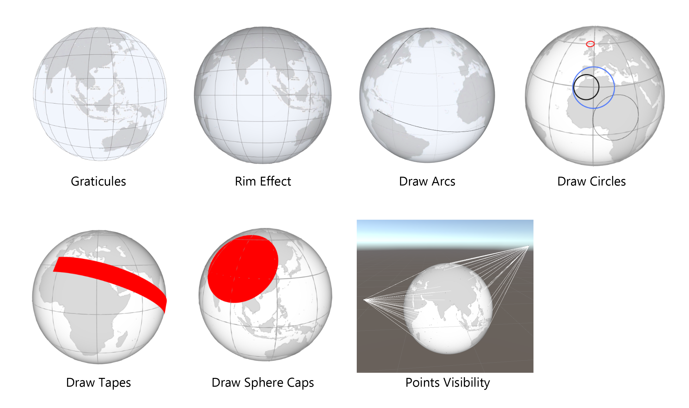

# Viz-Globe

Globe script for Unity. Good for geovisualization.

## Globe Features:

- Coordinate transformations World ↔ Geo (Latitude Longitude)
- Graticules
- Drawing arcs on the globe
- Draw circles on the globe
- Drawing tapes on the globe
- Drawing sphere caps on the globe
- Mid point between two geolocations
- Check if a point is on the visible side of the globe
- Rotate a geolocation to other geolocation
- Rotations with limit
- Egocentric globe (inside out globe)
- Rim effect

## Visualisation

- Flow globes
- Proportional symbol globes
- Bar globes
